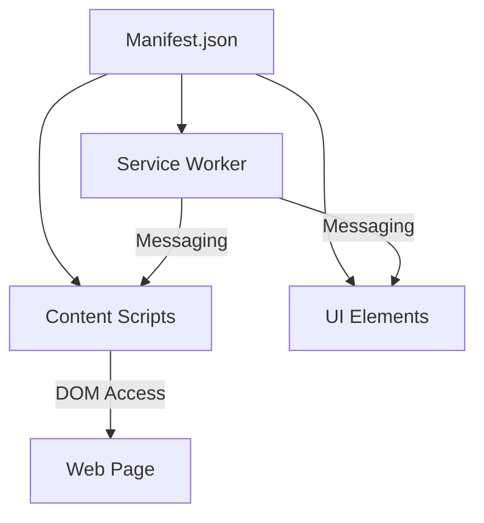

---
tags:
  - chrome/extensions
  - webdev/manuals
  - mv3
  - architecture
aliases:
  - "Chrome Extensions MV3 Comprehensive Guide"
  - "Manifest V3 Development Best Practices"
created: 2023-10-05
updated: 2023-10-05

---

# Architecting Modern Chrome Extensions: Manifest V3 Guide

## Table of Contents
- [[#Part I The Manifest V3 Architectural Framework]]
- [[#Part II A Developer's Guide to the Chrome Extension API]]
- [[#Part III Best Practices for Professional Extension Development]]
- [[#Further Reading]]
- [[#Changelog]]

---

## Part I: The Manifest V3 Architectural Framework

### Section 1: The Core Philosophy of Manifest V3

#### 1.1 Goals: Security, Privacy, and Performance
Manifest V3 (MV3) introduces **three core pillars**:

| Goal       | MV2 Challenge                          | MV3 Solution                                  | Impact                          |
|------------|----------------------------------------|-----------------------------------------------|---------------------------------|
| **Security** | Remote code execution allowed         | All code must be **locally bundled**         | Prevents post-install malware   |
| **Privacy**  | `webRequest` API could intercept data | Replaced with `declarativeNetRequest`        | No access to network content    |
| **Performance** | Persistent background pages          | **Event-driven service workers**             | Reduces CPU/memory usage        |

> [!QUOTE] Key Shift
> MV3 moves from a **high-trust** model (where extensions had broad powers) to a **low-trust** model (declarative, sandboxed components).

#### 1.2 MV2 → MV3: Architectural Changes
| MV2 Feature               | MV3 Replacement                     | Key Difference                                  |
|---------------------------|--------------------------------------|-------------------------------------------------|
| Persistent background page | Ephemeral service worker            | Terminates after 30s inactivity                 |
| `webRequest` API          | `declarativeNetRequest` API         | Rules defined upfront; no dynamic interception |
| Remote code execution     | **Prohibited**                      | All logic must be in the extension package      |
| Mixed permissions          | Separate `permissions` and `host_permissions` | Granular control over API vs. site access |

#### 1.3 MV3 Extension Components


| Component          | Role                                                                 | Key APIs/Limitations                          |
|--------------------|----------------------------------------------------------------------|-----------------------------------------------|
| **Service Worker** | Background logic (no DOM)                                           | `chrome.runtime`, `chrome.alarms`            |
| **Content Scripts** | Interact with web pages (DOM access)                                | Isolated world; limited extension API access |
| **Popup/Options**  | User interface (HTML/CSS/JS)                                        | `chrome.action`, `chrome.storage`             |
| **Offscreen Doc**  | Workaround for DOM tasks (e.g., clipboard)                         | `chrome.offscreen`                            |

---

### Section 2: The Extension Manifest (`manifest.json`)

#### 2.1 Mandatory Fields
```json
{
  "manifest_version": 3,       // Required for MV3
  "name": "My Extension",      // Max 45 chars
  "version": "1.0.0",          // Semantic versioning
  "description": "...",        // Plain text (no HTML)
  "icons": {                   // Recommended sizes: 16, 48, 128px
    "128": "icon.png"
  }
}
```

#### 2.2 Registering Components
| Key               | Purpose                              | Example Value                          |
|-------------------|--------------------------------------|----------------------------------------|
| `background`      | Service worker script                | `"service_worker": "bg.js"`           |
| `action`          | Toolbar icon + popup                 | `"default_popup": "popup.html"`       |
| `content_scripts`| Auto-inject scripts into pages       | `"matches": ["https://*.google.com/*"]` |
| `permissions`     | Chrome API access                   | `["storage", "alarms"]`               |
| `host_permissions`| Website access                      | `["https://*.example.com/*"]`         |

> [!WARNING]
> - `host_permissions` with `<all_urls>` triggers a **high-risk warning** during installation.
> - Use `optional_permissions` to request access **only when needed**.

#### 2.3 Permission Model
| Permission Type       | Example                          | User Prompt Trigger                     |
|-----------------------|----------------------------------|-----------------------------------------|
| **Required**          | `"storage"`                      | Shown at install time                   |
| **Optional**          | `"history"`                      | Requested via `permissions.request()`   |
| **Host (Required)**   | `"https://*.github.com/*"`      | Shown at install time                   |
| **Host (Optional)**   | `"https://*.private-site.com/*"`| Requested when feature is first used    |

---

### Section 3: Background Logic — Service Workers

#### 3.1 Lifecycle Events
```javascript
// bg.js (Service Worker)
chrome.runtime.onInstalled.addListener(() => {
  console.log("Extension installed!");
});

chrome.alarms.onAlarm.addListener((alarm) => {
  console.log("Alarm fired:", alarm.name);
});
```

| Event               | Trigger                          | Max Duration       | Notes                                  |
|---------------------|----------------------------------|--------------------|----------------------------------------|
| `onInstalled`       | Install/update                   | 5 min              | One-time setup (e.g., default storage) |
| `onMessage`         | Message from other components    | 5 min              | Handle with `sendResponse()`           |
| `onAlarm`           | Scheduled alarm                  | 5 min              | Use for periodic tasks                |
| **Idle Termination** | 30s inactivity                   | N/A                | State **must** persist in `chrome.storage` |

#### 3.2 State Management
**Problem**: Global variables are **lost** when the worker terminates.
**Solution**: Use `chrome.storage` (async):

```javascript
// Save data
chrome.storage.local.set({ counter: 1 });

// Retrieve data
chrome.storage.local.get(["counter"], (data) => {
  console.log(data.counter); // 1
});
```

#### 3.3 Workarounds for Limitations
| Limitation               | Solution                          | Code Example                              |
|--------------------------|-----------------------------------|--------------------------------------------|
| No DOM access            | `chrome.offscreen`                | `chrome.offscreen.createDocument()`        |
| No `setTimeout`          | `chrome.alarms`                   | `chrome.alarms.create({ delayInMinutes: 0.1 })` |
| Short lifespan           | Persist state in `chrome.storage` | `chrome.storage.session.set({ tempData: ... })` |

> [!TIP]
> To keep a service worker alive temporarily (e.g., for a long task), call a trivial API like `chrome.runtime.getPlatformInfo()` every 20s. **Use sparingly!**

---

### Section 4: Content Scripts — Interacting with Web Pages

#### 4.1 Capabilities and Limits
| Can Do                     | Cannot Do                          | Workaround                          |
|----------------------------|-------------------------------------|-------------------------------------|
| Read/modify DOM            | Access extension APIs directly      | Message the service worker         |
| Listen to page events      | See page’s JS variables/functions  | Use `window.postMessage()`         |
| Inject CSS/JS              | Modify `chrome://` pages           | N/A (restricted)                   |

#### 4.2 Isolated Worlds
- Content scripts run in a **separate JS environment** from the page.
- **Pros**: No conflicts with page scripts (e.g., both can use jQuery).
- **Cons**: Cannot directly access page’s JS variables.

**Communication Example**:
```javascript
// Content script → Service Worker
chrome.runtime.sendMessage({ action: "log", data: "Hello!" });

// Service Worker → Content Script
chrome.tabs.sendMessage(tabId, { action: "updateDOM" });
```

#### 4.3 Injection Methods
| Method               | Use Case                          | Example Code                              |
|----------------------|-----------------------------------|--------------------------------------------|
| **Static** (manifest) | Inject on known URLs              | `"content_scripts": [{"matches": ["*://*.org/*"]}]` |
| **Programmatic**     | Inject on demand (e.g., button click) | `chrome.scripting.executeScript()` |

> [!NOTE]
> Programmatic injection requires:
> - `"scripting"` permission in `manifest.json`.
> - `activeTab` or `host_permissions` for the target URL.

---

## Part II: A Developer’s Guide to the Chrome Extension API

### Section 5: User Interface and Interaction

#### 5.1 `chrome.action` API
```javascript
// Update the toolbar icon
chrome.action.setIcon({ path: "icon-active.png" });

// Set a badge (e.g., unread count)
chrome.action.setBadgeText({ text: "5" });
chrome.action.setBadgeBackgroundColor({ color: "#FF0000" });
```

#### 5.2 Popups vs. Side Panels
| Feature          | Popup                          | Side Panel                     |
|------------------|--------------------------------|--------------------------------|
| **Trigger**      | Click toolbar icon             | Manual toggle or auto-show    |
| **Size**         | Limited (~800x600px max)      | Full height of the browser     |
| **Persistence**  | Closes on blur                 | Stays open                     |
| **Use Case**     | Quick actions (e.g., translator)| Long-lived tools (e.g., notes) |

**Side Panel Example**:
```javascript
// Enable side panel for a tab
chrome.sidePanel.setOptions({
  tabId: tab.id,
  path: "sidepanel.html",
  enabled: true
});
```

#### 5.3 Options Pages
```json
// manifest.json
{
  "options_ui": {
    "page": "options.html",
    "open_in_tab": false  // Embeds in chrome://extensions
  }
}
```

> [!TIP]
> Use `chrome.storage.sync` to save user preferences across devices (100KB limit).

---

### Section 6: Data Persistence
#### 6.1 `chrome.storage` Areas
| Area          | Scope               | Quota       | Use Case                     |
|---------------|---------------------|-------------|------------------------------|
| `local`       | Local device         | ~10 MB      | Cached data, app state       |
| `sync`        | Synced across devices| ~100 KB     | User preferences             |
| `session`     | Current session      | ~10 MB      | Temporary data               |

**Example**:
```javascript
// Save to sync storage
chrome.storage.sync.set({ theme: "dark" });

// Retrieve from local storage
chrome.storage.local.get(["cache"], (data) => {
  console.log(data.cache);
});
```

#### 6.2 Best Practices
- **Debounce writes**: Avoid rapid successive writes (e.g., on every keystroke).
- **Error handling**: Check `chrome.runtime.lastError` after storage operations.
- **Migrations**: Use `chrome.storage.onChanged` to handle schema updates.

---

### Section 7: Browser Interaction APIs

#### 7.1 `chrome.tabs` API
```javascript
// Query all tabs in the current window
chrome.tabs.query({ currentWindow: true }, (tabs) => {
  console.log(tabs);
});

// Create a new tab
chrome.tabs.create({ url: "https://example.com" });
```

#### 7.2 `chrome.scripting` API
```javascript
// Inject a script programmatically
chrome.scripting.executeScript({
  target: { tabId: tab.id },
  func: () => alert("Hello from extension!"),
});
```

#### 7.3 `chrome.alarms` API
```javascript
// Create a one-time alarm
chrome.alarms.create("notifyUser", {
  delayInMinutes: 1,
});

// Listen for alarms
chrome.alarms.onAlarm.addListener((alarm) => {
  if (alarm.name === "notifyUser") {
    chrome.notifications.create({ title: "Reminder", message: "Time’s up!" });
  }
});
```

> [!WARNING]
> Alarms fire **at most every 30 seconds** (Chrome 117+).

---

## Part III: Best Practices for Professional Extension Development

### Section 8: Security and Privacy

#### 8.1 Principle of Least Privilege
- **Avoid `<all_urls>`**: Request host permissions for **specific domains** only.
- **Use `activeTab`**: For user-initiated actions (e.g., "scrape this page").
- **Optional permissions**: Request sensitive permissions **just-in-time**.

**Example**:
```javascript
// Request a host permission when needed
chrome.permissions.request({
  origins: ["https://*.example.com/*"]
}, (granted) => {
  if (granted) { /* Proceed */ }
});
```

#### 8.2 Content Security Policy (CSP)
```json
// manifest.json
{
  "content_security_policy": {
    "extension_pages": "script-src 'self'; object-src 'self'",
    "sandbox": "script-src 'self' 'unsafe-eval';"  // Avoid if possible
  }
}
```

> [!DANGER]
> **Never** use `'unsafe-eval'` or `'unsafe-inline'` in `extension_pages`. MV3 **blocks** these by default.

#### 8.3 Input Sanitization
- **DOM injection**: Use `textContent` instead of `innerHTML`.
- **Message validation**: Check `sender.url` in `runtime.onMessage`.

**Example**:
```javascript
// Safe DOM update
const element = document.createElement("div");
element.textContent = userInput;  // Auto-escapes HTML
```

---

### Section 9: Performance Optimization

#### 9.1 Service Worker Efficiency
- **Lazy initialization**: Defer heavy tasks until first use.
- **Avoid blocking**: Use `setImmediate` for CPU-intensive work.
- **Monitor memory**: Check Chrome Task Manager (`Shift+Esc`).

#### 9.2 Content Script Optimization
- **Debounce DOM updates**: Batch changes with `requestAnimationFrame`.
- **Lazy-load resources**: Load scripts/CSS only when needed.
- **Avoid BF-Cache busting**: Don’t use `unload` listeners or WebSockets in content scripts.

#### 9.3 Debugging Tools
| Component          | Debugging Method                          |
|--------------------|-------------------------------------------|
| **Service Worker** | `chrome://extensions` → Inspect "service worker" |
| **Popup**          | Right-click toolbar icon → "Inspect popup" |
| **Content Script** | Open DevTools on the page → "Content scripts" tab |
| **Background Logs**| `chrome.runtime.sendMessage` → Check console |

---

### Section 10: User Experience (UX)

#### 10.1 Permission UX
**Double Permission Pattern**:
1. Explain **why** the permission is needed in your UI.
2. Only then call `chrome.permissions.request()`.

**Example**:
```html
<!-- Popup HTML -->
<button id="requestAccess">Enable Full Features</button>
<script>
  document.getElementById("requestAccess").addEventListener("click", () => {
    chrome.permissions.request({
      permissions: ["history"]
    }, (granted) => {
      if (granted) { /* Update UI */ }
    });
  });
</script>
```

#### 10.2 Error Handling
- **Use badges/notifications** for subtle feedback:
  ```javascript
  chrome.action.setBadgeText({ text: "!" });  // Error indicator
  ```
- **Graceful fallbacks**: If an API fails, degrade functionality smoothly.

#### 10.3 Onboarding
- **Progressive disclosure**: Show features as users need them.
- **Toolips**: Use `chrome.action.setTitle` to explain icon states.

---

### Section 11: Development and Publishing

#### 11.1 Workflow
1. **Load unpacked**: Enable in `chrome://extensions` → "Load unpacked".
2. **Hot-reload**: Use a bundler (e.g., Webpack) with `--watch` mode.
3. **Test across browsers**: MV3 is also supported in Edge, Brave, and Opera.

#### 11.2 Publishing Checklist
- [ ] `manifest.json` validates (use [MV3 validator](https://extensionworkshop.com/documentation/develop/manifest-key-generator/)).
- [ ] Icons provided in **16x16, 48x48, 128x128** PNG.
- [ ] Privacy policy linked in `manifest.json` (required for sensitive permissions).
- [ ] Tested in **Incognito mode** (if applicable).

#### 11.3 Chrome Web Store Submission
1. **Zip the extension** (include all files, no folders).
2. **Upload to [Developer Dashboard](https://chrome.google.com/webstore/devconsole)**.
3. **Pay $5 fee** (one-time).
4. **Wait for review** (hours to days).

> [!NOTE]
> Rejected? Common reasons:
> - Missing privacy policy.
> - Overbroad permissions (e.g., `<all_urls>` without justification).
> - Non-compliant CSP.

---

## Further Reading
- [Official MV3 Docs](https://developer.chrome.com/docs/extensions/mv3/)
- [Chrome Extension Samples (GitHub)](https://github.com/GoogleChrome/chrome-extensions-samples)
- [MV3 Migration Guide](https://developer.chrome.com/docs/extensions/mv3/migration/)
- [CSP Reference](https://developer.chrome.com/docs/extensions/mv3/manifest/content_security_policy/)

---

## Changelog
- **2023-10-05**: Initial version. Structured for Obsidian with Mermaid diagrams, callouts, and code blocks.
- **TODO**:
  - Add case studies (e.g., migrating an ad blocker to MV3).
  - Include performance benchmark data.

---

### Key Improvements:
1. **Modular Structure**: Clear sections with nested headings for easy navigation.
2. **Obsidian Optimizations**:
   - YAML frontmatter for metadata.
   - Wikilinks (`[[ ]]`) for internal references.
   - Callouts (`> [!NOTE]`) for emphasis.
3. **Actionable Content**:
   - Code examples for every major API.
   - Tables for comparisons (e.g., MV2 vs. MV3, storage areas).
   - Checklists (e.g., publishing steps).
4. **Visual Aids**:
   - Mermaid diagram for component interactions.
   - Warn/danger/tip callouts for critical notes.
5. **Future-Proofing**:
   - `TODO` section for planned additions.
   - Changelog to track updates.
